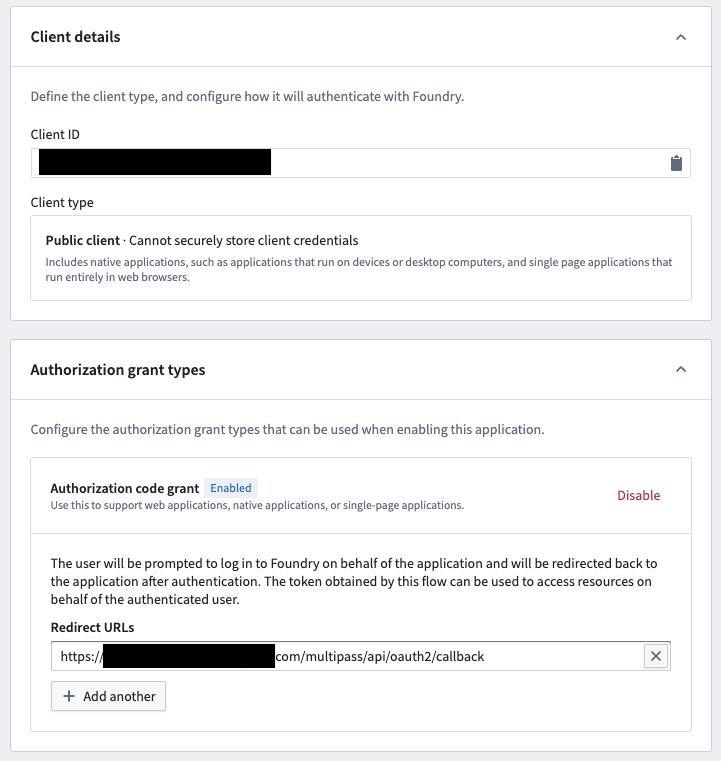

# SSO Authentication

You can create a [Third Party Application in Foundry] which is used for authenticating users.
It works in conjunction with the Python library `palantir-oauth-client`.
Once a function of `foundry-dev-tools` is run to access data sitting in Foundry, the auth process is started.

Example:



```python
from foundry_dev_tools import FoundryRestClient

rest_client = FoundryRestClient()
rest_client.get_user_info()
```

Steps:
1. Execute the above lines - a message with a URL will appear - visit this URL in your browser
2. Once opened, log in to Foundry (if necessary) using your account and allow  application
3. Copy the authorization code to the prompt of your Python commands and press Enter

The result of `get_user_info()` should appear, showing your Foundry user information.
At this point your temporary credentials are stored locally and will be used for future calls to Foundry.
