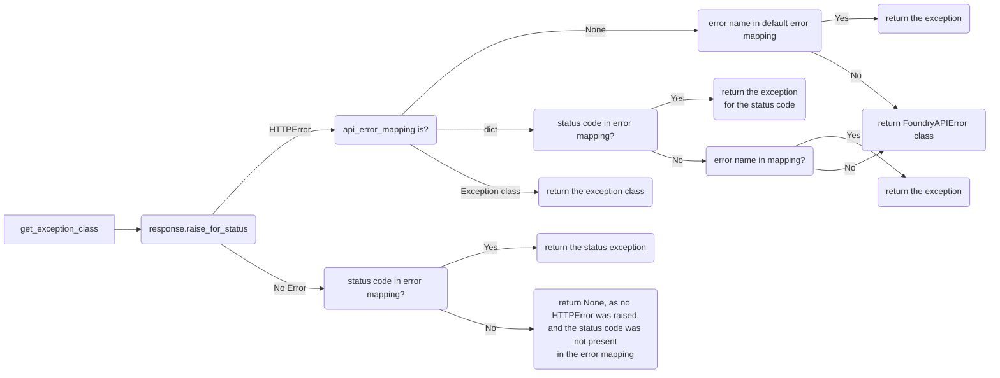

# Foundry DevTools Exceptions

- The [FoundryDevToolsError](#foundry_dev_tools.errors.meta.FoundryDevToolsError) class is the parent class for all custom exceptions that Foundry DevTools has.
  - The [FoundryAPIError] class is the parent class for all Foundry API errors, and the exception that gets raised when there is no custom exception for a Foundry error.
  - The [FoundryConfigError](#foundry_dev_tools.errors.config.FoundryConfigError) class is the parent class for all config related exceptions.
    - The [MissingCredentialsConfigError](#foundry_dev_tools.errors.config.MissingCredentialsConfigError) class gets raised when no configuration can be found that contains a credentials config.
    - The [TokenProviderConfigError](#foundry_dev_tools.errors.config.TokenProviderConfigError) class is a parent class for alle [token provider configuration](configuration.md#credentials-config) related exceptions.

## Foundry API Errors

### Error mapping

The mapping [DEFAULT_ERROR_MAPPING](#foundry_dev_tools.errors.handling.DEFAULT_ERROR_MAPPING) maps the errors returned by the API to a custom exception class.
The mapping provided to the [ErrorHandlingConfig] takes precedence over the default mapping.

### Raise Foundry API Errors
The [ContextHTTPClient.request](#foundry_dev_tools.clients.context_client.ContextHTTPClient.request) method raises the errors via the [raise_foundry_api_error](#foundry_dev_tools.errors.handling.raise_foundry_api_error) method,
this means, in most of the cases a developer of an API client does not need to care about raising specific errors, as long they are in the [error mapping](#error-mapping).

The method only takes two arguments, the [response](#requests.Response) and the error_handling argument takes either an [ErrorHandlingConfig], None or False (True is not valid!).
If error_handling is False, then no error handling will be done, if it is None it will use the default [ErrorHandlingConfig], otherwise it will use the specified [ErrorHandlingConfig].

:::{literalinclude} ../../../src/foundry_dev_tools/errors/handling.py
:pyobject: raise_foundry_api_error
:::

### ErrorHandlingConfig

The config takes two arguments `api_error_mapping` and `info`, both are optional.
All keyword arguments will be saved, and will be passed to the constructor of the [FoundryAPIError] class.

The `api_error_mapping` argument can be used to map status codes and error names to exception classes that base on [FoundryAPIError].
When supplied with only a class and not a mapping, then all HTTP Errors will return this exception  class.

The `info` argument can be used to add additional information to the exception, regardless of the class.

#### get_exception method
This method is a simple wrapper around the [#get_exception_class method], if it returns a class it will instantiate it with the requests response, the info, and the kwargs provided.

#### get_exception_class method

In the `get_exception_class` method of the [ErrorHandlingConfig] class resides the logic which selects the appropriate exception class.

This mermaid diagram shows what happens:



:::{literalinclude} ../../../src/foundry_dev_tools/errors/handling.py
:pyobject: ErrorHandlingConfig.get_exception_class
:::

#### Get parameters

The exception parameters get handed to the exception class determined by the logic above.


### Implement a custom exception

Custom exceptions implement the [FoundryAPIError] class and can override the [message](#foundry_dev_tools.errors.meta.FoundryAPIError.message) attribute to a fitting error message.

An example implementation:

```python
from foundry_dev_tools.errors.meta import FoundryAPIError
class ExampleError(FoundryAPIError):
    """Raised when the example exception happens."""
    message = "Example error happened :O"
```

Which could then be registered in the mapping:
```python
...
  "ExampleAPI:example_error":ExampleError,
...
```

[ErrorHandlingConfig]: #foundry_dev_tools.errors.handling.ErrorHandlingConfig
[FoundryAPIError]: #foundry_dev_tools.errors.meta.FoundryAPIError
