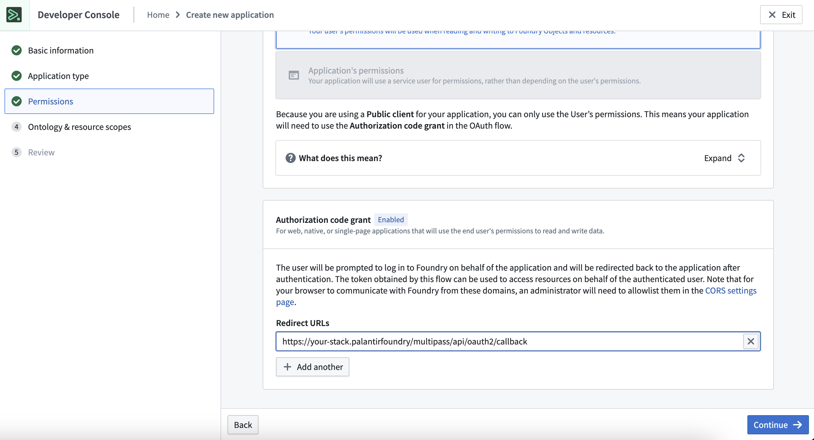
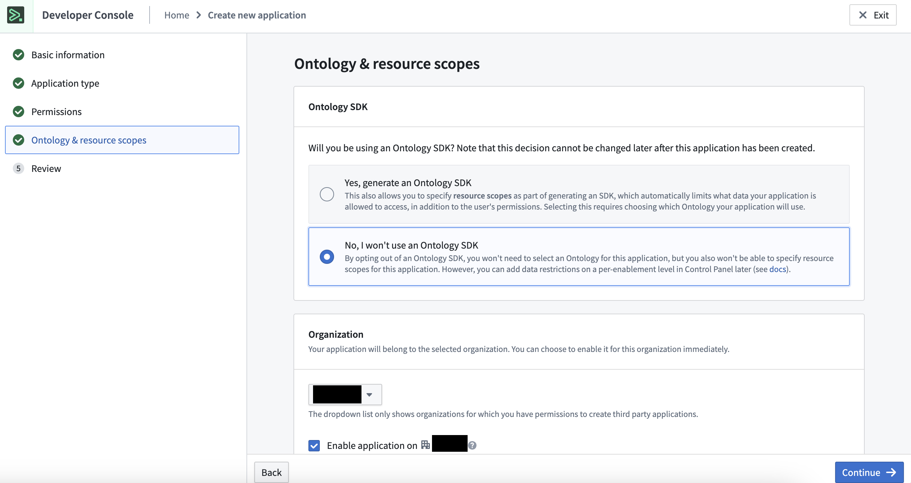
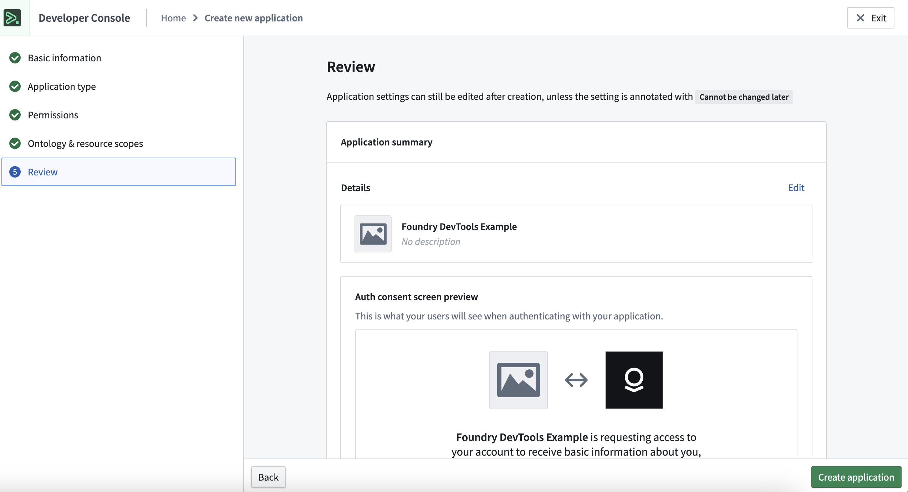

# SSO Authentication

The recommendation how to connect to Foundry from Foundry DevTools is using the [Third Party Application Feature in Foundry](https://www.palantir.com/docs/foundry/platform-security-third-party/third-party-apps-overview/).
With this approach, no long-lived user tokens need to be generated.

You can create a [Third Party Application in Foundry](https://www.palantir.com/docs/foundry/platform-security-third-party/third-party-apps-overview/) which is used for authenticating users.
The actual oauth2 flow is implemented by the Palantir provided Python library `palantir-oauth-client`.
Once a function of `foundry-dev-tools` is run to access data sitting in Foundry, the auth process is started.

## Example Configuration via the Developer Console:

1. Create a new Application
2. Fill out the Basic Information
3. Select client facing Application

4. Continue and scroll down to Authorization Code Grant, make sure to set the Redirect URLs to `https://<stack-url>/multipass/api/oauth2/callback`

5. Deselect Ontology SDK and enable the Application for your Organization

6. Review your Application and create the application.



To authenticate with this Third Party Application you need to set the client ID in your [Configuration](../configuration.md)
If you have set a user-token previously, delete the `jwt` entry of the configuration.

You can use the following code to test the authentication - this flow will also be triggered with any API call to Foundry:

```python
from foundry_dev_tools import FoundryContext

ctx = FoundryContext()
ctx.multipass.get_user_info()
```

Steps:

1. Execute the above lines - a message with a URL will appear - visit this URL in your browser
2. Once opened, log in to Foundry (if necessary) using your account and allow application
3. Copy the authorization code to the prompt of your Python commands and press Enter

The result of `get_user_info()` should appear, showing your Foundry user information.
At this point your temporary credentials are stored locally and will be used for future calls to Foundry.
